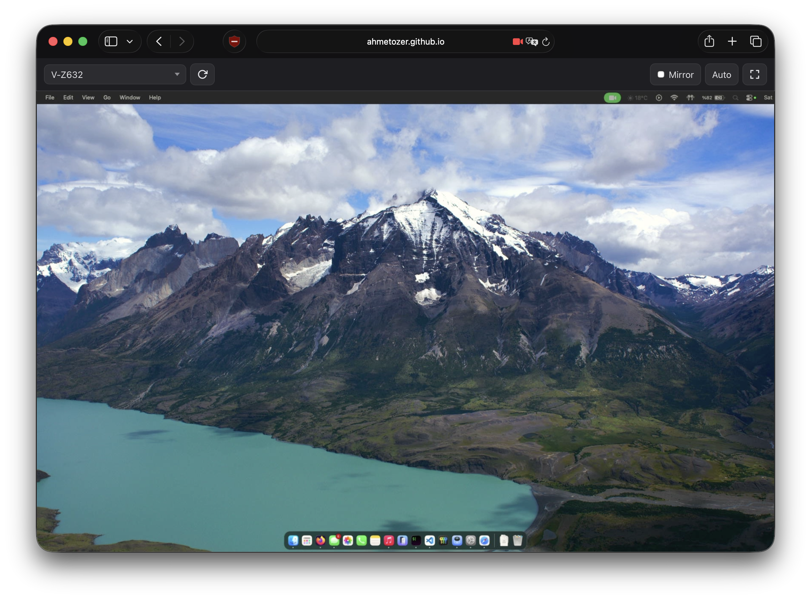

# Input Displayer

A lightweight PWA that displays video from USB capture devices in the browser. Designed for use as a monitor replacement, teleprompter display, or camera preview.

**Live demo:** https://ahmetozer.github.io/input-displayer/



## Features

- **Device selection** -- dropdown lists all available video inputs, switch sources on the fly
- **Mirror mode** -- horizontal flip for teleprompter / selfie use
- **Fullscreen** -- toolbar auto-hides after 3 seconds, reappears on mouse/touch
- **Reconnect** -- detects device disconnection, one-tap reconnect
- **Dark mode** -- cycles between Auto (system), Light, and Dark
- **Offline support** -- works without network after first load via service worker
- **High resolution** -- requests up to 4K@60fps from the device

## Browser Support

- Safari (iOS 15.4+)
- Firefox (Android)
- Chrome / Edge (desktop & mobile)

HTTPS or localhost is required for camera access.

## Files

```
index.html              UI structure
sw.js                   Service worker (offline caching)
assets/
  style.css             Styles, dark mode, responsive layout
  app.js                Application logic
  manifest.json         PWA manifest
```

## Usage

Serve the directory over HTTPS with any static server:

```sh
npx serve .
```

Open the URL, select a video device from the dropdown, and click **Connect**.

### Add to Home Screen

On mobile, use the browser's "Add to Home Screen" option. The app runs in standalone mode with offline support.

## Updating the Cache

When you modify any file, bump the version string in `sw.js`:

```js
const CACHE = 'input-displayer-v2'; // increment version
```

This ensures returning users get the updated files.
